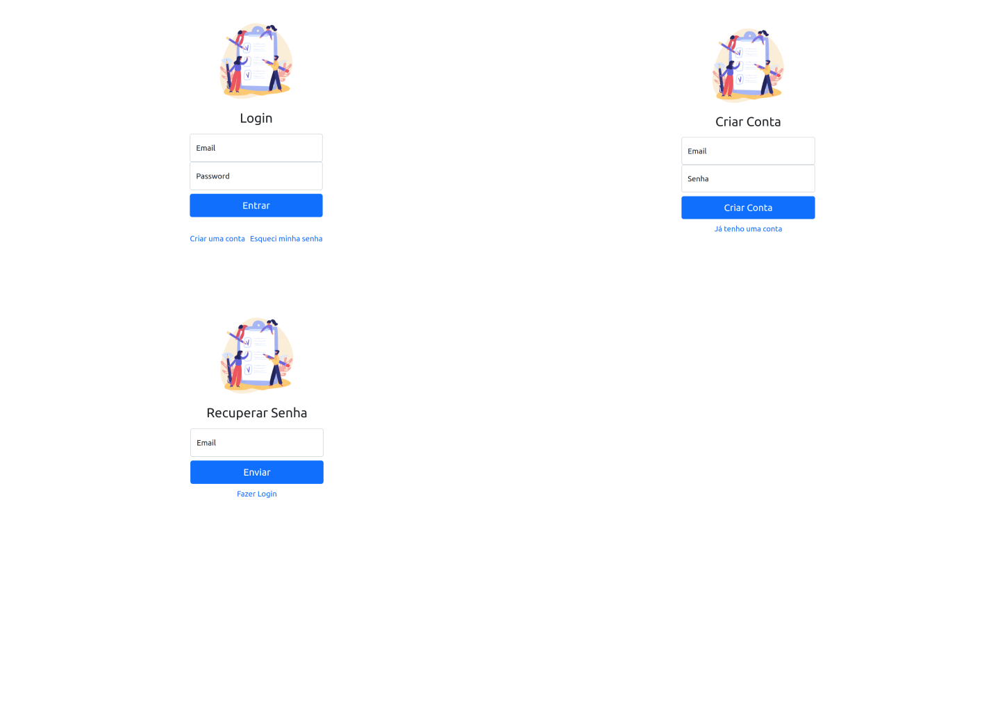
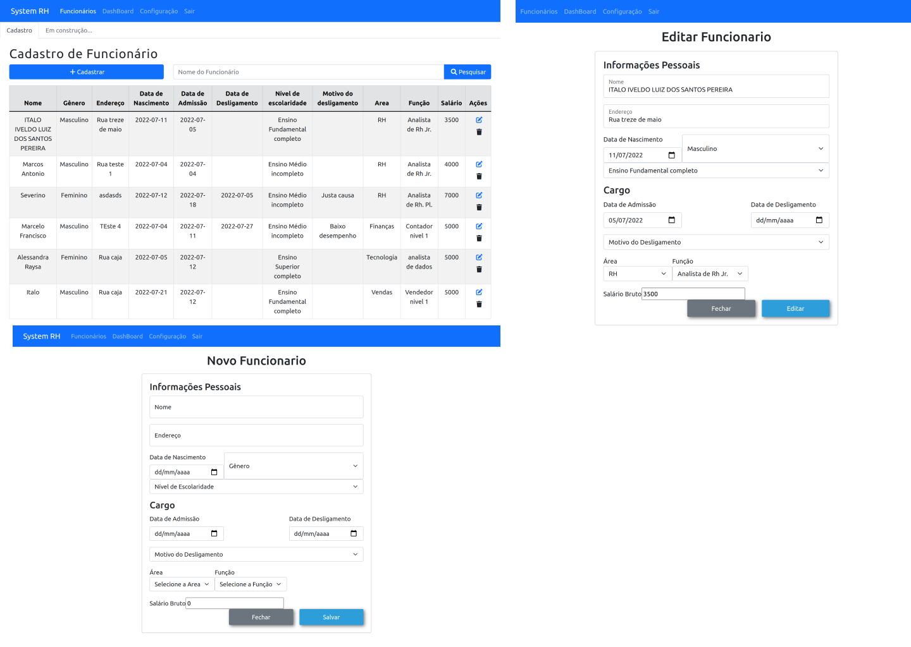
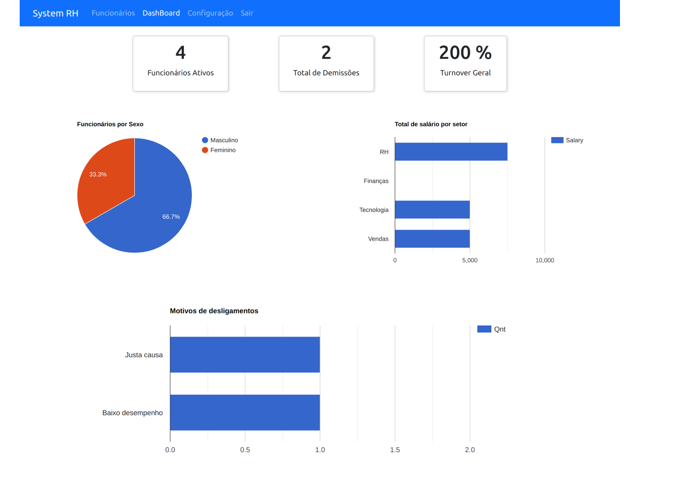
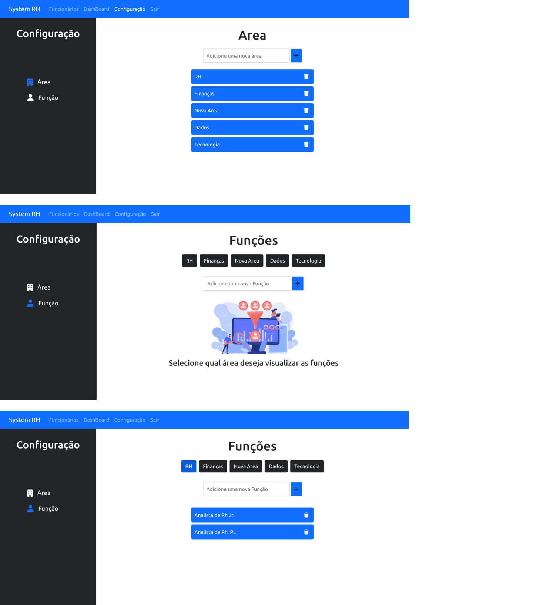
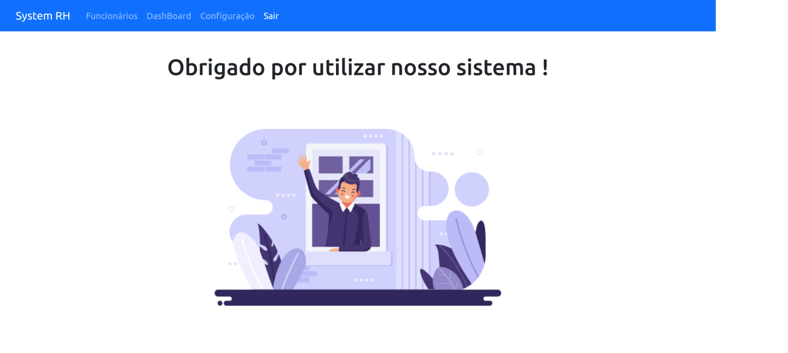

<h1 align="center">
     <a href="#" alt="site de despesa"> System RH - Do zero ao Deploy</a>
</h1>

<h3 align="center">
    Um MVP de um mini sistema para controle de funcionários completamente funcional.
</h3>

<h4 align="center">
	🚧   Em andamento 🚀 🚧
</h4>

Tabela de conteúdos
=================
<!--ts-->
   * [Sobre o projeto](#-sobre-o-projeto)
   * [Funcionalidades](#-funcionalidades)
   * [Layout](#-layout)
   * [Tecnologias](#-tecnologias)
  * [Lições Aprendidas](#-LiçõesAprendidas)

<!--te-->

## 💻 Sobre o projeto

Este é um projeto pessoal e teve como objetivo utilizar os conhecimentos que adiquirir até o momento para criar um MVP de um sistema de recursos humanos que fosse possível ser utilizado e gerasse algum valor !

---

## ⚙️ Funcionalidades

- [x] Controle de acesso
- [x] Cadastro de usuários
- [x] Fluxo para recupera senhas
- [x] CRUD para cadastro de funcionários
- [x] Possíbilidade de cadastro de áreas e funções da sua empresa de forma personalizada
- [x] Dashboard com alguns indicadores de Recursos Humanos

---

## 🎨 Layout

  ### Login

  

  ### Home

  
  
  ### DashBoard

  

  ### Configurações

  

  ### Logout

  

---

## 🛠 Tecnologias

As seguintes ferramentas foram usadas na construção do projeto:

-   **React Router Dom**
-   **Bootstrap**
-   **ContextAPI**
-   **Firebase**
-   **React google Charts**
-   **Lodash React**

---

## Lições Aprendidas Durante o projeto

-   Criar um template básico no figma para se guiar durante o projeto - Não utilizei acabei muitas vezes perdido no que deveria ser feito.
-  Definir o escopo da aplicação antes de começar a codar.
- Antes feito que perfeito !

## Link de Preview do projeto

  <a href="https://crud1-4d41d.web.app/" alt="projeto System RH" >Preview</a>
